# Development Workflow Example

For this example, I'll be walking through resolving the following bug: https://github.com/brendanjmeade/celeri_ui/issues/40
In case you want to "follow along", check out the following commit: `d379b87f459a28667ea1f3785ce34c9eb831dd5a`
You can also look at the `development-example` branch.

First up is ensuring you have an up to date code base. I tend to like to create a new gitpod workspace for each issue I'm working on, since it ensures things are fresh and up to date, but if you are working locally you can just checkout `main` & `git pull` to ensure it's up to date.

Then, we want to explore the issue abit more - we need to reproduce it, and try to see where it breaks/causes issues. In this case - I took the following steps:

- Opening a segment file
- Select a single segment connects to two other segments, one on each end, and delete it 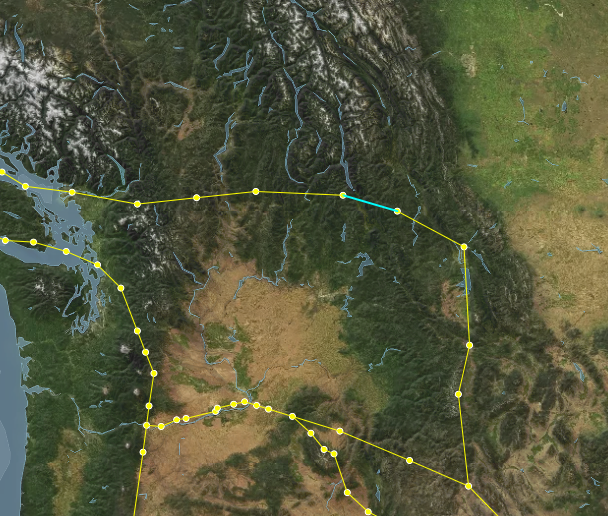
  - this looks like it behaved correctly, neither of the vertices were deleted because they are still connected to other segments.
- Select one of the formerly adjacent segments, which now has one vertex that doesn't connect to any other segments, and delete it 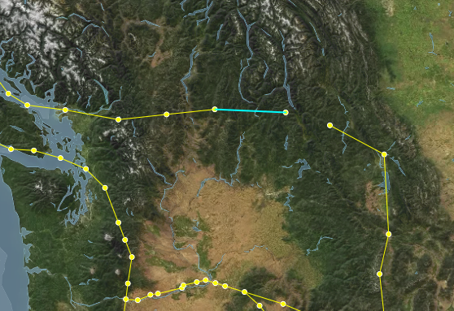
  - this also seems to behave correctly, the dangling vertex was deleted, but the connect vertex wasn't
- Select one of the segments further one step away from the edge, and delete it 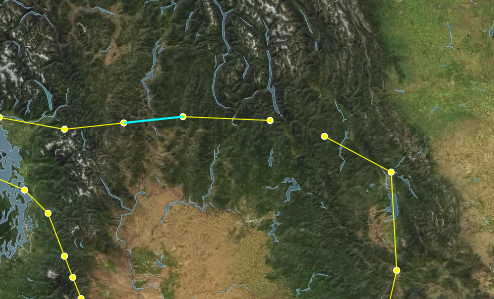
- The Select the "floating" segment and delete it 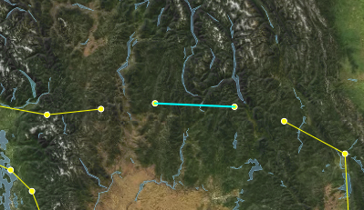
  - This again works correctly - both the vertices connected to that segment are deleted.
- All of this suggests, to me, that the issue comes from having multiple segments deleted at once, so lets try that
- Switch to the Segment edit mode, and Lasso-select 3 connected segments, one of which has only one connected segment, then delete them 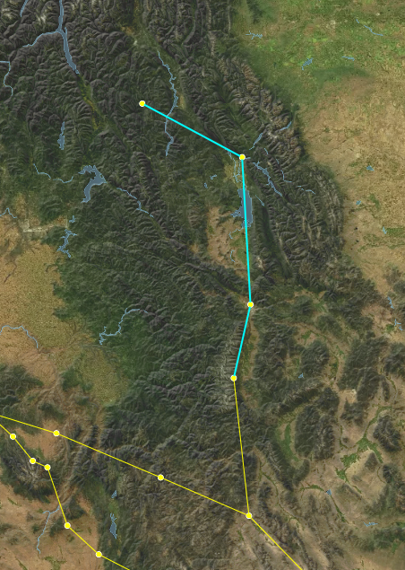
  - Here we finally replicated the issue - the segments are deleted, but the vertices seem to all remain - including the one that was originally "dangling" 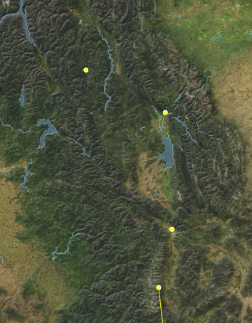

This suggests that the issue is that the segment deletion logic doesn't know how to handle multiple segments being deleted at once while also getting rid of their connected vertices. So lets take a look at the relevant tests. Because we are dealing with segment state, we should go take a look at the [mocha/tests/SegmentState.spec.tsx](https://github.com/brendanjmeade/celeri_ui/blob/d379b87f459a28667ea1f3785ce34c9eb831dd5a/mocha/tests/SegmentState.spec.tsx)

Looking through the code, I found 3 test cases that seem relevant - one starting on line 74, one on line 88 & one on line 103. Interestingly, it looks like the only difference between the first two is that the latter one also verifies that there are no vertices remaining. Since they don't test different scenarios, I'll delete the one at 74. So now we have two existing tests: `can delete a segment` & `can delete a segment sharing a vertex with another segment`.
Both of those behaviours remain appropriate for our current scenario, so lets create a new test, after the `can delete a segment sharing a vertex with another segment`.
I'll call it `can delete multiple segments & their associated vertices`:

```typescript
it('Can delete multiple segments & their associated vertices', () => {
	/* Here I'm setting up the initial state
      I want to have 3 segments connected in a line
    */
	const firstSegment = SegmentReducer(initialState, {
		type: 'createSegmet',
		payload: {
			start: { lon: 0, lat: 0 },
			end: { lon: 1, lat: 1 }
		}
	})
	const secondSegment = SegmentReducer(firstSegment, {
		type: 'createSegmet',
		payload: {
			start: { lon: 1, lat: 1 },
			end: { lon: 2, lat: 2 }
		}
	})
	const thirdSegment = SegmentReducer(secondSegment, {
		type: 'createSegmet',
		payload: {
			start: { lon: 2, lat: 2 },
			end: { lon: 3, lat: 3 }
		}
	})

	// Now we run the delete operation, and tell it to delete the first two segments
	const state = SegmentReducer(thirdSegment, {
		type: 'deleteSegment',
		payload: { index: [0, 1] }
	})

	// Investigating the resulting state, we expect to only have one segment left, and only two vertices
	expect(state.segments).to.have.length(1)
	expect(Object.keys(state.vertecies)).to.have.length(2)

	// The segment we have left should be the third segment we created
	expect(state.segments[0].start).to.equal(2)
	expect(state.segments[0].end).to.equal(3)
	// And the vertices we have left should match the vertices used by that segment
	expect(state.vertecies[2].lat).equal(2)
	expect(state.vertecies[3].lat).equal(3)
})
```

Then I run `npm run test` in the console, and check the result. Strangely, this new test still seems to pass! That tells us that the issue is either with the code calling the segment deletion function, or that our test doesn't correctly isolate the factors causing this bug.
Since our manual tests did suggest that this should correctly isolate the bug, let's take a look at how the segment deletion process gets triggered first.

My first instinct is to look in [src/Components/SegmentsPanel.tsx](https://github.com/brendanjmeade/celeri_ui/blob/d379b87f459a28667ea1f3785ce34c9eb831dd5a/src/Components/SegmentsPanel.tsx), since I know the Segments Panel is where we delete segments. However, looking through there I don't see a specific location where deletion is called - but I do see that `EditableItem` has a `deletable` tag, so I look at the function it calls - `setSegmentData`. That get's passed in by the parent component, so we can search for where the segments panel is used - [src/Components/Inspector.tsx](https://github.com/brendanjmeade/celeri_ui/blob/d379b87f459a28667ea1f3785ce34c9eb831dd5a/src/Components/Inspector.tsx) on line 315.

Here, we look for `setSegmentData`, and find that it has the following code:

```typescript
;(index, data): void => {
	if (data) {
		dispatch(editSegmentData({ indices: index, data }))
	} else {
		dispatch(deleteSegment({ index }))
	}
}
```

So now we know that the dispatch looks correct - when no data is passed, this is treated as a delete operation, in which case we pass the indices of the segments we want to delete...

This takes us back to the drawing board - it seems like the issue isn't with the data coming in to our deletion operation, and it looks like our test suggests that the delete operation itself is working correctly. So lets see if maybe it's actually an issue with the map not refreshing to display the correct information?

To test this - we'll first repeat the steps we took before, so we get back to the step where we reproduced the issue:


Then, we force a refresh of the vertex display on the map, by swapping to Vertex edit mode - at which point our mystery vertices disapper!

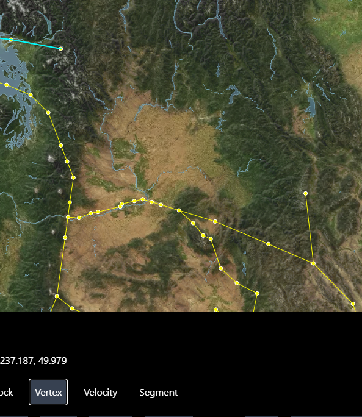

This means it's not triggering an update of the vertices displayed. For most things in the maps, a re-render is triggered by the object representing the state being replaced - so this might be a situation where we are accidentally mutating an object in place rather than actually replacing it during the state change.

At this point, I'm not sure if this is the case, but it's the best theory I've got so we're going to try and investigate it. Lets go back out our test in `SegmentState.spec.tsx`.

We'll start by adding something to verify that our vertex object is actually being replaced:

```typescript
// Added these next two lines
expect(state.vertecies).to.not.equal(thirdSegment.vertecies)
expect(state.vertexDictionary).to.not.equal(thirdSegment.vertexDictionary)

expect(state.segments).to.have.length(1)
expect(Object.keys(state.vertecies)).to.have.length(2)

expect(state.segments[0].start).to.equal(2)
expect(state.segments[0].end).to.equal(3)
expect(state.vertecies[2].lat).equal(2)
expect(state.vertecies[3].lat).equal(3)
```

and then we run it with `npm run test` - and it seems to pass. So the issue doesn't show up here, yet.

On the one hand, this does narrow things down a bit - it loos like this happens between the point where the vertices are changed, and the point where they are actually drawn on the map.

So now is the time to open the debugger, and look at things as they happen! In the browser, open the dev tools (either by tapping `f12` on the keyboard, or right clicking somewhere that isn't the map and selecting "Inspect"), then navigate to the "Sources" tab.
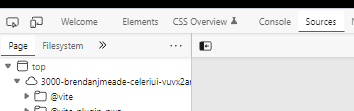

Next, we need to find the file where we update drawn points - `/src/Utilities/SetupPointSources.tsx` - in the file hierarchy on the left - it'll be under `workspace/celeri_ui/src/Utilities`
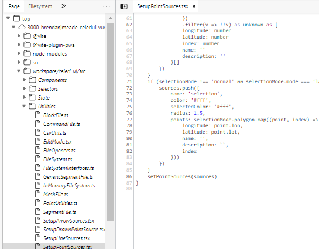

Once we have the file open, we can set break points - points that will stop the execution of the code and let us see what's going on in real time - by clicking to the left of the line numbers at the points we want to inspect. In this case - we want to see when the vertices are updated, and it looks like that is hidden behind the if statement at line 38 - so we'll put the break point right after that:
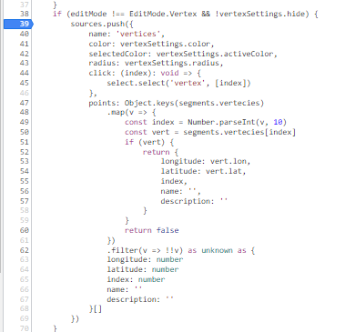

Now, let's lasso-select a few segments again - you'll notice that the moment we switch to Lasso Selection mode, or to Segment edit mode (if you weren't in that mode before), the breakpoint triggers. This is too early for us to get information, so let's click the breakpoint again to remove it, and click the play button or `f8` to resume.
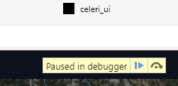

First, we need to select some segments, with the lasso select tool. Then we'll re-add the breakpoint at the same place, and then we'll click the delete button in the segment panel.
This does seem to trigger our breakpoint - which means it should have the up to date information, but when we resume (by clicking play or `f8`), we see the issue persists...

So let's try to manually refresh - if we do so by changing the edit mode, it seems things happen as expected as well. But if we just try to toggle the vertex display, we see that it doesn't seem to trigger our breakpoint! And the vertices don't get hidden.
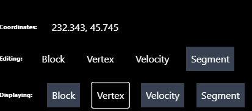

Once I noticed that, I realized that we actually allow editing vertices while in Segment edit mode - so we actually have vertices passing in to the drawn points in addition to the vertex points, but we probably aren't updating those!
