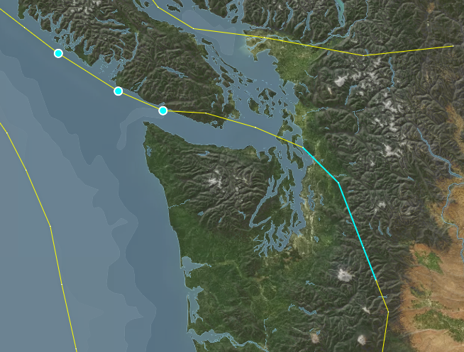
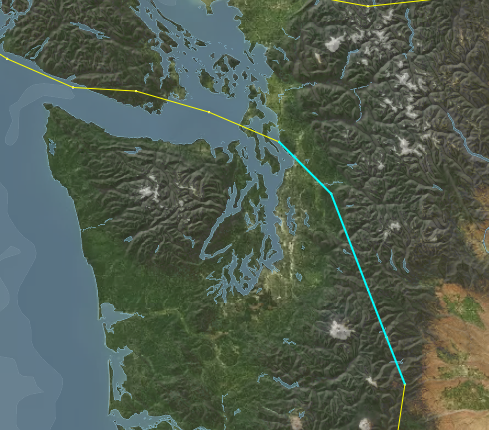
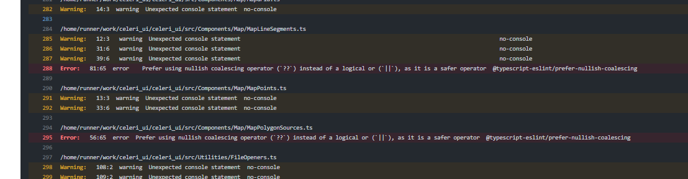

# Development Workflow Example

For this example, I'll be walking through resolving the following bug: https://github.com/brendanjmeade/celeri_ui/issues/40
In case you want to "follow along", check out the following commit: `d379b87f459a28667ea1f3785ce34c9eb831dd5a`
You can also look at the `development-example` branch.

First up is ensuring you have an up to date code base. I tend to like to create a new gitpod workspace for each issue I'm working on, since it ensures things are fresh and up to date, but if you are working locally you can just checkout `main` & `git pull` to ensure it's up to date.

Then, we want to explore the issue abit more - we need to reproduce it, and try to see where it breaks/causes issues. In this case - I took the following steps:

- Opening a segment file
- Select a single segment connects to two other segments, one on each end, and delete it 
  - this looks like it behaved correctly, neither of the vertices were deleted because they are still connected to other segments.
- Select one of the formerly adjacent segments, which now has one vertex that doesn't connect to any other segments, and delete it 
  - this also seems to behave correctly, the dangling vertex was deleted, but the connect vertex wasn't
- Select one of the segments further one step away from the edge, and delete it 
- The Select the "floating" segment and delete it 
  - This again works correctly - both the vertices connected to that segment are deleted.
- All of this suggests, to me, that the issue comes from having multiple segments deleted at once, so lets try that
- Switch to the Segment edit mode, and Lasso-select 3 connected segments, one of which has only one connected segment, then delete them 
  - Here we finally replicated the issue - the segments are deleted, but the vertices seem to all remain - including the one that was originally "dangling" 

This suggests that the issue is that the segment deletion logic doesn't know how to handle multiple segments being deleted at once while also getting rid of their connected vertices. So lets take a look at the relevant tests. Because we are dealing with segment state, we should go take a look at the [mocha/tests/SegmentState.spec.tsx](https://github.com/brendanjmeade/celeri_ui/blob/d379b87f459a28667ea1f3785ce34c9eb831dd5a/mocha/tests/SegmentState.spec.tsx)

Looking through the code, I found 3 test cases that seem relevant - one starting on line 74, one on line 88 & one on line 103. Interestingly, it looks like the only difference between the first two is that the latter one also verifies that there are no vertices remaining. Since they don't test different scenarios, I'll delete the one at 74. So now we have two existing tests: `can delete a segment` & `can delete a segment sharing a vertex with another segment`.
Both of those behaviours remain appropriate for our current scenario, so lets create a new test, after the `can delete a segment sharing a vertex with another segment`.
I'll call it `can delete multiple segments & their associated vertices`:

```typescript
it('Can delete multiple segments & their associated vertices', () => {
	/* Here I'm setting up the initial state
      I want to have 3 segments connected in a line
    */
	const firstSegment = SegmentReducer(initialState, {
		type: 'createSegmet',
		payload: {
			start: { lon: 0, lat: 0 },
			end: { lon: 1, lat: 1 }
		}
	})
	const secondSegment = SegmentReducer(firstSegment, {
		type: 'createSegmet',
		payload: {
			start: { lon: 1, lat: 1 },
			end: { lon: 2, lat: 2 }
		}
	})
	const thirdSegment = SegmentReducer(secondSegment, {
		type: 'createSegmet',
		payload: {
			start: { lon: 2, lat: 2 },
			end: { lon: 3, lat: 3 }
		}
	})

	// Now we run the delete operation, and tell it to delete the first two segments
	const state = SegmentReducer(thirdSegment, {
		type: 'deleteSegment',
		payload: { index: [0, 1] }
	})

	// Investigating the resulting state, we expect to only have one segment left, and only two vertices
	expect(state.segments).to.have.length(1)
	expect(Object.keys(state.vertecies)).to.have.length(2)

	// The segment we have left should be the third segment we created
	expect(state.segments[0].start).to.equal(2)
	expect(state.segments[0].end).to.equal(3)
	// And the vertices we have left should match the vertices used by that segment
	expect(state.vertecies[2].lat).equal(2)
	expect(state.vertecies[3].lat).equal(3)
})
```

Then I run `npm run test` in the console, and check the result. Strangely, this new test still seems to pass! That tells us that the issue is either with the code calling the segment deletion function, or that our test doesn't correctly isolate the factors causing this bug.
Since our manual tests did suggest that this should correctly isolate the bug, let's take a look at how the segment deletion process gets triggered first.

My first instinct is to look in [src/Components/SegmentsPanel.tsx](https://github.com/brendanjmeade/celeri_ui/blob/d379b87f459a28667ea1f3785ce34c9eb831dd5a/src/Components/SegmentsPanel.tsx), since I know the Segments Panel is where we delete segments. However, looking through there I don't see a specific location where deletion is called - but I do see that `EditableItem` has a `deletable` tag, so I look at the function it calls - `setSegmentData`. That get's passed in by the parent component, so we can search for where the segments panel is used - [src/Components/Inspector.tsx](https://github.com/brendanjmeade/celeri_ui/blob/d379b87f459a28667ea1f3785ce34c9eb831dd5a/src/Components/Inspector.tsx) on line 315.

Here, we look for `setSegmentData`, and find that it has the following code:

```typescript
;(index, data): void => {
	if (data) {
		dispatch(editSegmentData({ indices: index, data }))
	} else {
		dispatch(deleteSegment({ index }))
	}
}
```

So now we know that the dispatch looks correct - when no data is passed, this is treated as a delete operation, in which case we pass the indices of the segments we want to delete...

This takes us back to the drawing board - it seems like the issue isn't with the data coming in to our deletion operation, and it looks like our test suggests that the delete operation itself is working correctly. So lets see if maybe it's actually an issue with the map not refreshing to display the correct information?

To test this - we'll first repeat the steps we took before, so we get back to the step where we reproduced the issue:


Then, we force a refresh of the vertex display on the map, by swapping to Vertex edit mode - at which point our mystery vertices disapper!


This means it's not triggering an update of the vertices displayed. For most things in the maps, a re-render is triggered by the object representing the state being replaced - so this might be a situation where we are accidentally mutating an object in place rather than actually replacing it during the state change.

At this point, I'm not sure if this is the case, but it's the best theory I've got so we're going to try and investigate it. Lets go back out our test in `SegmentState.spec.tsx`.

We'll start by adding something to verify that our vertex object is actually being replaced:

```typescript
// Added these next two lines
expect(state.vertecies).to.not.equal(thirdSegment.vertecies)
expect(state.vertexDictionary).to.not.equal(thirdSegment.vertexDictionary)

expect(state.segments).to.have.length(1)
expect(Object.keys(state.vertecies)).to.have.length(2)

expect(state.segments[0].start).to.equal(2)
expect(state.segments[0].end).to.equal(3)
expect(state.vertecies[2].lat).equal(2)
expect(state.vertecies[3].lat).equal(3)
```

and then we run it with `npm run test` - and it seems to pass. So the issue doesn't show up here, yet.

On the one hand, this does narrow things down a bit - it loos like this happens between the point where the vertices are changed, and the point where they are actually drawn on the map.

So now is the time to open the debugger, and look at things as they happen! In the browser, open the dev tools (either by tapping `f12` on the keyboard, or right clicking somewhere that isn't the map and selecting "Inspect"), then navigate to the "Sources" tab.


Next, we need to find the file where we update drawn points - `/src/Utilities/SetupPointSources.tsx` - in the file hierarchy on the left - it'll be under `workspace/celeri_ui/src/Utilities`


Once we have the file open, we can set break points - points that will stop the execution of the code and let us see what's going on in real time - by clicking to the left of the line numbers at the points we want to inspect. In this case - we want to see when the vertices are updated, and it looks like that is hidden behind the if statement at line 38 - so we'll put the break point right after that:


Now, let's lasso-select a few segments again - you'll notice that the moment we switch to Lasso Selection mode, or to Segment edit mode (if you weren't in that mode before), the breakpoint triggers. This is too early for us to get information, so let's click the breakpoint again to remove it, and click the play button or `f8` to resume.


First, we need to select some segments, with the lasso select tool. Then we'll re-add the breakpoint at the same place, and then we'll click the delete button in the segment panel.
This does seem to trigger our breakpoint - which means it should have the up to date information, but when we resume (by clicking play or `f8`), we see the issue persists...

So let's try to manually refresh - if we do so by changing the edit mode, it seems things happen as expected as well. But if we just try to toggle the vertex display, we see that it doesn't seem to trigger our breakpoint! And the vertices don't get hidden.


Once I noticed that, I realized that we actually allow editing vertices while in Segment edit mode - so we actually have vertices passing in to the drawn points (points that can be moved) in addition to the vertex points, but we probably aren't updating those!

So - let's move to see what's happening where those points are set! First, lets get rid of the breakpoint (by clicking on it), and then we'll go in and find where the the drawn points are set - [src/Utilities/SetupDrawnPointSource.tsx](https://github.com/brendanjmeade/celeri_ui/blob/d379b87f459a28667ea1f3785ce34c9eb831dd5a/src/Utilities/SetupDrawnPointSource.tsx), open it up in the browser dev tools and set a breakpoint at line 37/38 - right at the start of the function. Then - we can start experimenting with adjusting the edit mode & the display, to try to find out what happens.

First, I set the edit mode to vertex, which triggered the function, and it went into the "EditMode.Vertex" case, where it sets the data for drawing the vertices. Then, I turned off the Vertex display, which did the same thing, but passes it an empty array of vertices - so the points disappears. I turned the vertex display back on, then swapped to Segment edit mode. This time, it went to the default case, and didn't set the drawn points at all! Meaning that so long as we are in Segment edit mode, the drawn vertices don't get updated. I tried deleting segments with the Lasso again, and saw the same things - it goes to the default case, which does nothing.

So let's try and fix that - we want to make a case for segment edit mode. Now - I think we would likely still want the ability to select & move vertices while in segment edit mode, since vertices & segments are so tightly coupled. The main difference between these modes should be the Lasso. So - we'll just make the Segment edit mode apply the same case as the Vertex edit mode in there `src/Utilities/SetupDrawnPointSource.tsx`:

```typescript
switch (editMode) {
		case EditMode.Segments: //added this line here
		case EditMode.Vertex: {
			setDrawnPointSource({
				color: vertexSettings.color,
				radius: vertexSettings.radius,
				selectedColor: vertexSettings.activeColor,
				selectedRadius: vertexSettings.activeRadius,
				points: vertexSettings.hide
					? []
					: (Object.keys(segments.vertecies)
							.map(v => {
								const index = Number.parseInt(v, 10)
								const vert = segments.vertecies[index]
								if (vert) {
									return {
										longitude: vert.lon,
										latitude: vert.lat,
										index
									}
								}
								return false
							})
							.filter(v => !!v) as unknown as {
							longitude: number
							latitude: number
							index: number
					  }[]),
				update: (index, vertex) => {
					dispatch(moveVertex({ index, vertex }))
				},
				select: index => {
					select.select('vertex', index)
				}
			})

			break
		}
```

To see how this works/if this works, we should refresh the page, reload the segment file, and then try to lasso-select & delete the segments. This time, it seems to work!

While playing around with this, however - I noticed a curious thing. Sometimes, when I lasso select some segments, it seems to also change the selected Vertices on the map - but not select them in the vertices tab. (note - I made regular vertices tiny and selected vertices huge to highlight the effect)


So - lets look at that. The displayed selections on the map get set in [src/App](https://github.com/brendanjmeade/celeri_ui/blob/d379b87f459a28667ea1f3785ce34c9eb831dd5a/src/App.tsx) - where it sets the map selections (line 418). Here we have what seems to be the source of the issue: the lasso selection is automatically set as the selection for "draw" - the points that can be moved on the map.

```typescript
selections={{
					segments: selectedSegment,
					blocks: selectedBlock,
					velocities: selectedVelocity,
					vertices: selectedVertex,
					draw: lassoSelection
				}}
```

If we add a condition there to exclude the segment edit mode, then we should avoid selecting those situations!

```typescript
selections={{
					segments: selectedSegment,
					blocks: selectedBlock,
					velocities: selectedVelocity,
					vertices: selectedVertex,
					draw: editMode === EditMode.Segments ? undefined :lassoSelection
				}}
```

For now we'll ignore the squiggly line under "draw" - that just means there is a type issue, which we'll fix if this solves the main issue we're seeing. Let's see if that same issue persists - I'll try selecting the same segments that caused the issue before. And it seems like it works!


So now, let's just resolve that type issue. The "selections" property of `CeleryMap` currently has a type of `Record<string, number[]>` - let's adjust that to `Record<string, number[] | undefined>`. We can do that by going to [src/Components/Map/CeleriMap.tsx](https://github.com/brendanjmeade/celeri_ui/blob/d379b87f459a28667ea1f3785ce34c9eb831dd5a/src/Components/Map/CeleriMap.tsx), going to the `MapProperties` interface (line 48), and adjusting the selctions property.

However, since we've made that change, it is worth checking whether that leads to any type issues - this is one of the benefits of using typescript! It can catch issue that might arise from our changes. A good way to do that, if you are running in gitpod, is to use the `tsc` command in the console. In this case, I got the following result:

````
gitpod /workspace/celeri_ui (development-example) $ tsc
src/Components/Map/MapArrows.ts:248:6 - error TS2322: Type 'number[] | undefined' is not assignable to type 'number[]'.
  Type 'undefined' is not assignable to type 'number[]'.

248      updatedInternalSelections[sourcename] = selections[sourcename]
         ~~~~~~~~~~~~~~~~~~~~~~~~~~~~~~~~~~~~~

src/Components/Map/MapDrawnPoints.ts:113:51 - error TS2322: Type 'number[] | undefined' is not assignable to type 'number[]'.
  Type 'undefined' is not assignable to type 'number[]'.

113      internalSelections: { ...internalSelections, draw: selections.draw }
                                                      ~~~~

src/Components/Map/MapLineSegments.ts:237:6 - error TS2322: Type 'number[] | undefined' is not assignable to type 'number[]'.
  Type 'undefined' is not assignable to type 'number[]'.

237      updatedInternalSelections[sourcename] = selections[sourcename]
         ~~~~~~~~~~~~~~~~~~~~~~~~~~~~~~~~~~~~~

src/Components/Map/MapPoints.ts:170:6 - error TS2322: Type 'number[] | undefined' is not assignable to type 'number[]'.
  Type 'undefined' is not assignable to type 'number[]'.

170      updatedInternalSelections[sourcename] = selections[sourcename]
         ~~~~~~~~~~~~~~~~~~~~~~~~~~~~~~~~~~~~~


Found 4 errors in 4 files.

Errors  Files
     1  src/Components/Map/MapArrows.ts:248
     1  src/Components/Map/MapDrawnPoints.ts:113
     1  src/Components/Map/MapLineSegments.ts:237
     1  src/Components/Map/MapPoints.ts:170
		 ```

Looks like we forgot to adjust the `internalSelections` property of the map's state to match! The map has some internal states that duplicate properties, as a way to help it detect when things changed. So let's make that adjustment - you'll find it in the `MapState` interface (line 26 of `/src/Components/Map/CeleriMap.tsx`) - and we just need to change it to match the type of the `selections` property.

Let's run `tsc` again to confirm that it resolved our issue - and it should return nothing, which means the type issues were resolved!

So now we're basically done, we just have to run the tests locally, commit & push the result!

Once you do that, it is important to wait for the tests & code quality pass to run, and see whether it fails for whatever reason. You can do so here: [Github Actions](https://github.com/brendanjmeade/celeri_ui/actions) - in this case, the tests did fail, and looking through the details of the failure I found this:


Interestingly, running `npm run test` locally doesn't produce that result, but it's still worth resolving. So we go to the two locations mentioned in the error `src/Components/Map/MapLineSegments.ts` line 81 & `src/Components/Map/MapPolygonSources.ts` line 56, and replace the logical or `||` with the nullish operator `??`, like so:
```typescript
selected: selections[source.name]?.includes(line.index) || false
becomes
selected: selections[source.name]?.includes(line.index) ?? false
```

and then we run the tests, commit, push, and keep an eye on the github actions again.
````
